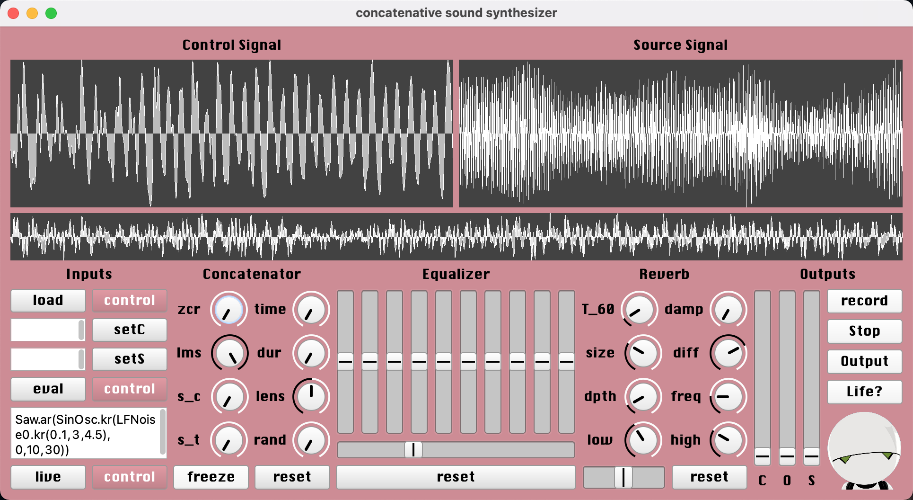
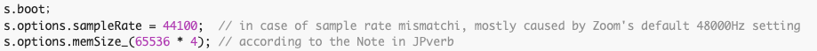
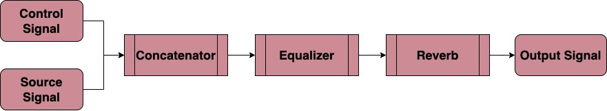

# concatenative-synthesizer
A synthesizer based on Supercollider's extension function Concat2 for anyone who wants to create glitch or ambient music

## Setup:

### 1. Download Supercollider

Go to [the offical website of Supercollider](https://supercollider.github.io/download) and download the current version for your system 

This project was created under SuperCollider 3.12.1 for Mac and not tested in Linux or Windows environments.

### 2. Preparation

Run the first three lines to boot the supercollider engine and set basic parameters

### 3. Run the synthesizer

Run the main codes and you can see the GUI now

Have Fun~

## Usage:

concatenative sound synthesizer (CSS) is based on the Concat2 extension in Supercollider and  combined with  series of audio signal processing units like EQ & Reverb. The main idea as showed in the Concat2 extension's document 

> Implementation of concatenative sound synthesis based on matching four features from a control input to the database generated from a source input. The control determines which frames of the source get played back, and you can change the weighting of features to refine your matching criteria (ie, make rms the most heavily weighted to have amplitude as the most important criteria). You can also modulate the match length, being the amount of source played back for a match, the feature weightings, and freeze the database collection to work with a collected sample from the source.

With a comprehensive GUI makes CSS easier to use for whom has no programming knowledge. 

Check **concatenative sound synthesizer.pdf** for detail

